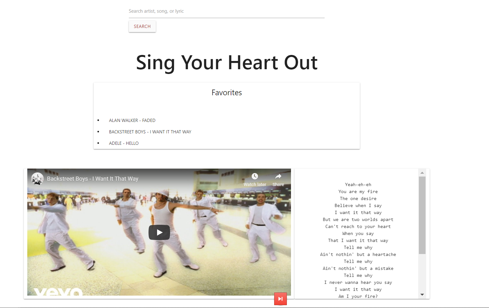

# Sing Your Heart Out - MusicMatch

## Description

An app where users can search for their favorite songs and have the music video and lyrics side-by-side. The top result from Youtube will be returned as the music video. Users can cycle through to the next top result by clicking the small arrow button underneath the video. The lyrics are gathered through the MusicMatch API. Users can favorite their search result by clicking the heart icon at the bottom of the page.

## Technologies

- Materialize
- Firebase
- Youtube API
- MusicMatch API

